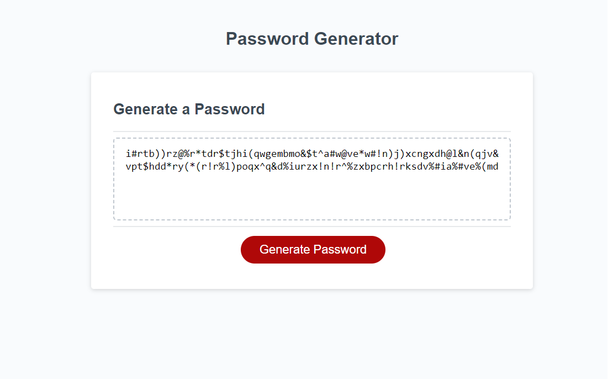

# Javascript Password Generator

## Description

Provide a short description explaining the what, why, and how of your project. Use the following questions as a guide:

- What was your motivation?
    - To showcase that I have a strong understanding enough understanding of JavaScript to be able to develop a password generator based on some user prompts on their requirements.
- What did you learn?
    - My working knowledge of the below loops has improved dramatically.
        - For loops
        - While
        - Do While
    - Improved understanding of if and if else statements.
    - Practical use of functions.
    - Improved understanding of local and global scope.

## Table of Contents (Optional)

If your README is long, add a table of contents to make it easy for users to find what they need.

- [Usage](#usage)
- [Credits](#credits)
- [License](#license)

## Usage

- You can navigate this page and follow the links to see demonstrations that I Garrett Winter are able to accomplish as a full stack developer.

    - This webpage can be viewed by following the below link:
        - https://garrettwinter.github.io/javascript-password-generator-build/
        
    - Below a screenshot of the webpage as of 11/10/2022
        - 

## Credits

While working on this project I had collaborated in real-time with:
  - Garrett Winter (https://github.com/garrettWinter)
  - Salahuddin Imdad (https://github.com/Sal8298)

At the start of this project, I viewed the following tutorial to starting ideas:
    - https://www.foolishdeveloper.com/2021/07/random-password-generator-javascript.html

## License

MIT License

Copyright (c) 2022 Garrett Winter

Permission is hereby granted, free of charge, to any person obtaining a copy
of this software and associated documentation files (the "Software"), to deal
in the Software without restriction, including without limitation the rights
to use, copy, modify, merge, publish, distribute, sublicense, and/or sell
copies of the Software, and to permit persons to whom the Software is
furnished to do so, subject to the following conditions:

The above copyright notice and this permission notice shall be included in all
copies or substantial portions of the Software.

THE SOFTWARE IS PROVIDED "AS IS", WITHOUT WARRANTY OF ANY KIND, EXPRESS OR
IMPLIED, INCLUDING BUT NOT LIMITED TO THE WARRANTIES OF MERCHANTABILITY,
FITNESS FOR A PARTICULAR PURPOSE AND NONINFRINGEMENT. IN NO EVENT SHALL THE
AUTHORS OR COPYRIGHT HOLDERS BE LIABLE FOR ANY CLAIM, DAMAGES OR OTHER
LIABILITY, WHETHER IN AN ACTION OF CONTRACT, TORT OR OTHERWISE, ARISING FROM,
OUT OF OR IN CONNECTION WITH THE SOFTWARE OR THE USE OR OTHER DEALINGS IN THE
SOFTWARE.

